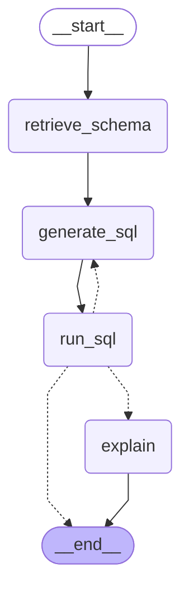

# Manav Mishra | GenAI Portfolio

A hub for live generative AI and machine learning projects. The landing page reads a project registry and renders a card for each app, while the FastAPI backend auto-registers one router per backend app.

- **Live site:** [manav-mishra-genai-portfolio.vercel.app](https://manav-mishra-genai-portfolio.vercel.app/)
- **API:** [manav-mishra-genai-portfolio.onrender.com](https://manav-mishra-genai-portfolio.onrender.com/)
- **API docs:** [/docs](https://manav-mishra-genai-portfolio.onrender.com/docs)
- **Health check:** [/api/health](https://manav-mishra-genai-portfolio.onrender.com/api/health)

> The backend runs on a free tier and may sleep when idle. The first request after inactivity can take 30-60 seconds.

## Stack

- **Frontend:** React, Vite, Tailwind CSS, and React Router on Vercel
- **Backend:** FastAPI on Render
- **Planned LLM providers:** Groq and Gemini free tiers
- **Cost target:** $0/month

## Repository Structure

```text
.
├── frontend/                 # React app and app pages
│   ├── src/projects.json     # Project registry for the landing page
│   └── src/apps/             # Lazy-loaded frontend app pages
├── backend/                  # FastAPI service
│   ├── app/main.py           # API setup and router auto-discovery
│   ├── app/apps/              # One router file per backend app
│   └── requirements.txt
├── render.yaml               # Render service configuration
├── .gitignore
└── README.md
```

## Architecture

The Text-to-SQL demo is orchestrated by a compiled LangGraph workflow:



[View the generated PNG diagram](docs/text-to-sql-flow.png)

## Run Locally

### Backend

Windows PowerShell:

```powershell
cd backend
python -m venv venv
.\venv\Scripts\Activate.ps1
pip install -r requirements.txt
uvicorn app.main:app --reload
```

macOS or Linux:

```bash
cd backend
python -m venv venv
source venv/bin/activate
pip install -r requirements.txt
uvicorn app.main:app --reload
```

The API runs at `http://localhost:8000`. Interactive documentation is available at `http://localhost:8000/docs`.

### Frontend

In a new terminal:

```bash
cd frontend
npm install
npm run dev
```

Create `frontend/.env` for local API access:

```env
VITE_API_URL=http://localhost:8000
```

The frontend runs at `http://localhost:5173`.

## Deployment

### Vercel: Frontend

- **Root directory:** `frontend`
- **Build command:** `npm run build`
- **Environment variable:** `VITE_API_URL=https://<render-api-url>`

`frontend/vercel.json` contains the SPA rewrite required for React Router refreshes. Vercel redeploys the frontend when changes are pushed to the production branch.

### Render: Backend

- **Root directory:** `backend`
- **Build command:** `pip install -r requirements.txt`
- **Start command:** `uvicorn app.main:app --host 0.0.0.0 --port $PORT`
- **Plan:** Free
- **Environment variable:** `ALLOWED_ORIGINS=http://localhost:5173,https://<vercel-app-url>`

Keep Groq, Gemini, and other private API keys in the backend's Render environment only. Never put secrets in frontend `VITE_*` variables because Vite exposes them to the browser.

The root `render.yaml` contains the service configuration for a Render Blueprint deployment.

### Deployment Env Vars

| Service | Variable | Value |
| --- | --- | --- |
| Vercel | `VITE_API_URL` | `https://manav-mishra-genai-portfolio.onrender.com` |
| Render | `ALLOWED_ORIGINS` | `http://localhost:5173,https://manav-mishra-genai-portfolio.vercel.app` |
| Render | `NVIDIA_API_KEY` | Your NVIDIA API key, stored only in Render |
| Render | `EMBED_MODEL` | Optional; defaults to `nvidia/nemotron-3-embed-1b` |

Do not commit `.env` files or API keys. Keep `NVIDIA_API_KEY` unquoted in environment settings. Vercel preview deployments are also accepted by the backend CORS pattern.

## Updating the Live Site

The repository currently deploys from `master`:

```bash
git add .
git commit -m "Describe the change"
git push origin master
```

Vercel and Render can redeploy automatically after the push. After changing a Vercel environment variable, trigger a new deployment so the frontend receives the updated value.

When adding a Python dependency, install it in the backend virtual environment and refresh the lock list:

```bash
pip freeze > requirements.txt
```

## Add a New App

1. Add `backend/app/apps/<name>.py` with a FastAPI `router`. The backend discovers and mounts it at `/api/<name>` automatically.
2. Add `frontend/src/apps/<name>/index.jsx` for the app page.
3. Add a lazy route for the page in `frontend/src/App.jsx`.
4. Add the app metadata to `frontend/src/projects.json`.
5. After changing the graph, run `python scripts/export_graph.py` from `backend/` and commit the updated files in `docs/`.
6. Push the changes and verify both deployments.

## Roadmap

- [x] Landing page and FastAPI skeleton
- [x] Frontend and backend deployment configuration
- [ ] RAG: chat with your PDF
- [ ] Tool-using AI agent
- [ ] Text-to-SQL
- [ ] Classic ML demo
